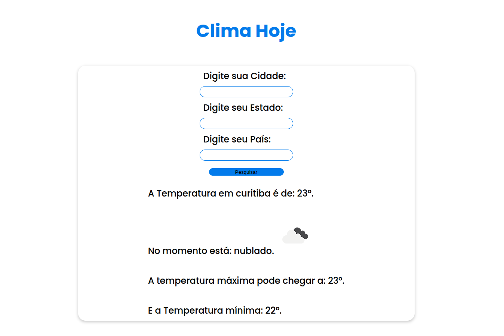

# ☁️ Weather API

Aplicação com consumo de API's de Clima.

## 🚀 Funcionalidades

* **Geocoding:** integração com geoconding para converter a cidade, estado e país em coordenadas.
* **Temperaturas e clima** em tempo real.
* **Ícones dinâmicos** que alternam conforme o tempo.

## 🛠️ Tecnologias

* **HTML5 & CSS3:** estrutura semântica e estilização.
* **JavaScript (ES6+):** 
    * Async/Await
    * DOM manipulation
    * Try/Catch
* [API OpenWeather](https://openweathermap.org/)

## 🛠️ Como Usar

1. Clone este repositório.
2. Faça uma conta e pegue sua chave gratuita pelo site **[API OpenWeather](https://openweathermap.org/)**
3. Abra o arquivo `script.js` e cole sua chave no campo `appid={YOUR_API_KEY_HERE}` onde é passado a URL da API.
4. Abra do `index.html` no seu navegador.
5. Coloque a Cidade, Estado e País.
6. Pesquise e obtenha o resultado!!.